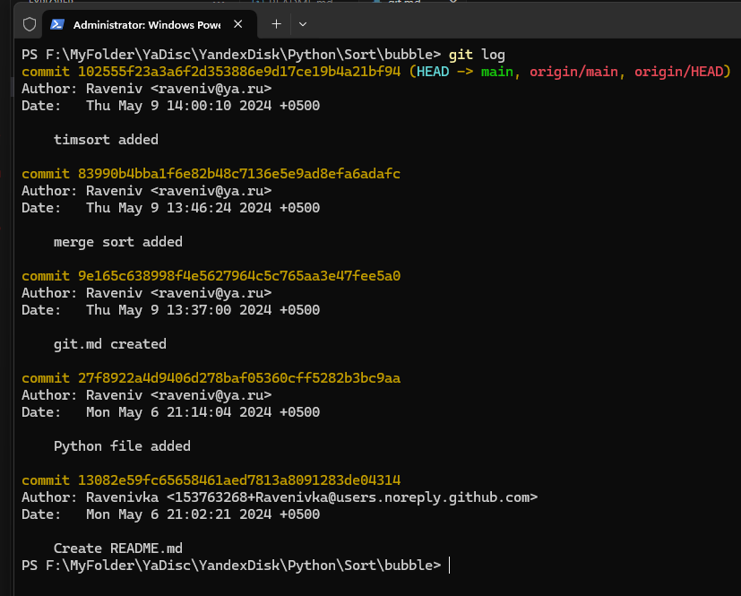
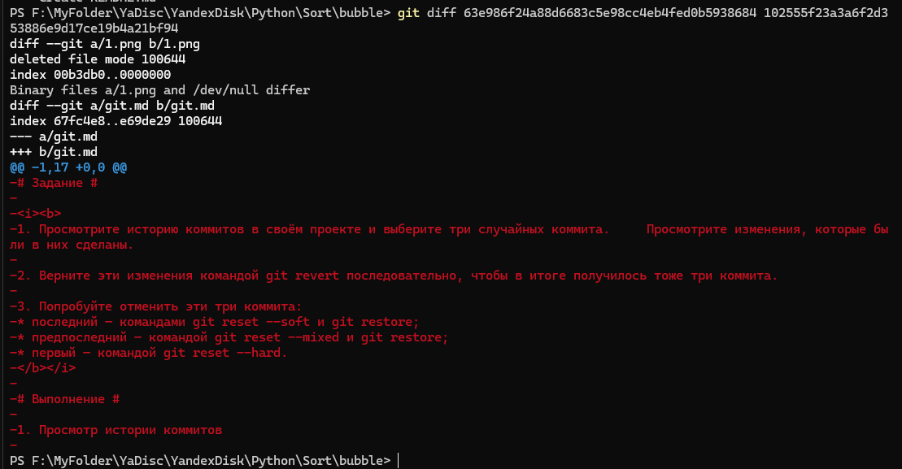
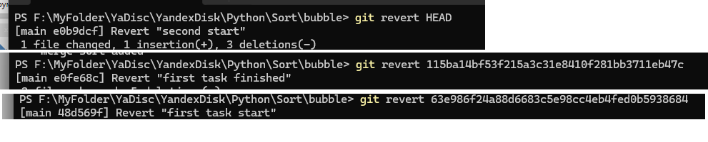
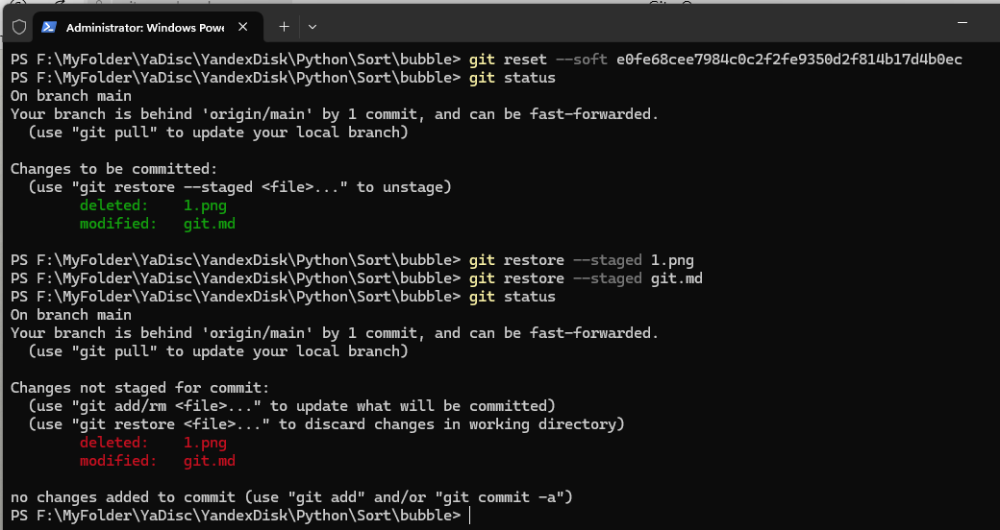
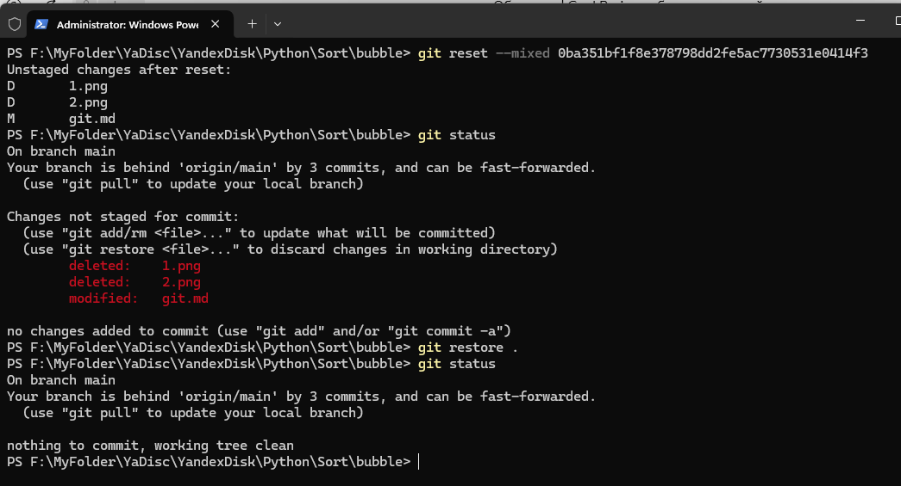
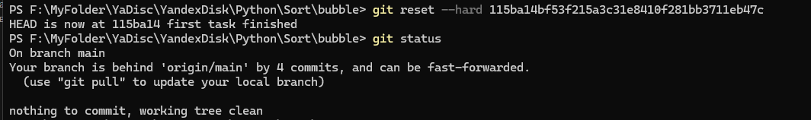

# Задание #

<i><b>
1. Просмотрите историю коммитов в своём проекте и выберите три случайных коммита.     Просмотрите изменения, которые были в них сделаны.

2. Верните эти изменения командой git revert последовательно, чтобы в итоге получилось тоже три коммита.

3. Попробуйте отменить эти три коммита:
* последний — командами git reset --soft и git restore;
* предпоследний — командой git reset --mixed и git restore;
* первый — командой git reset --hard. 
</b></i>

# Выполнение #

1. Просмотр истории коммитов

Просмотр изменений

2. Верните эти изменения командой git revert последовательно, чтобы в итоге получилось тоже три коммита.

3. Попробуйте отменить эти три коммита:
* последний — командами git reset --soft и git restore;

* предпоследний — командой git reset --mixed и git restore;

* первый — командой git reset --hard.

